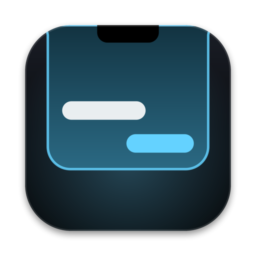
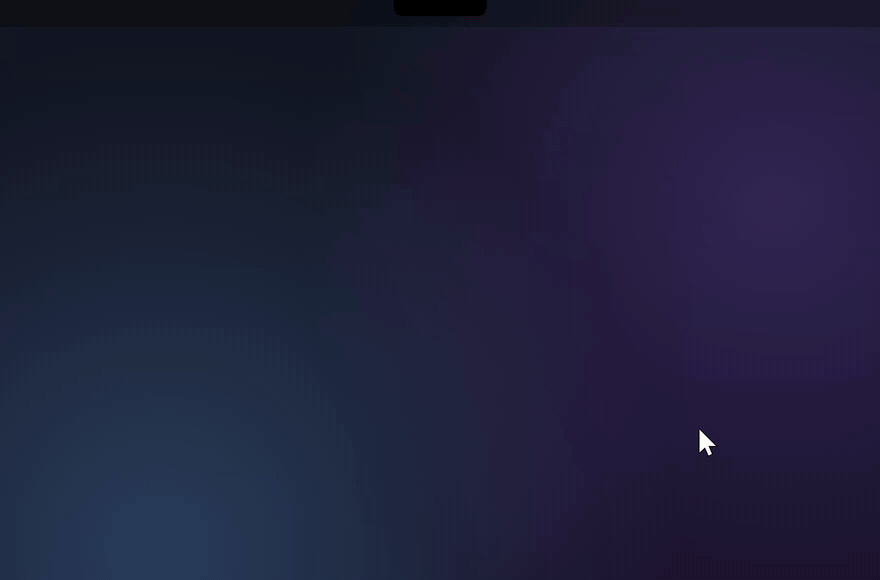
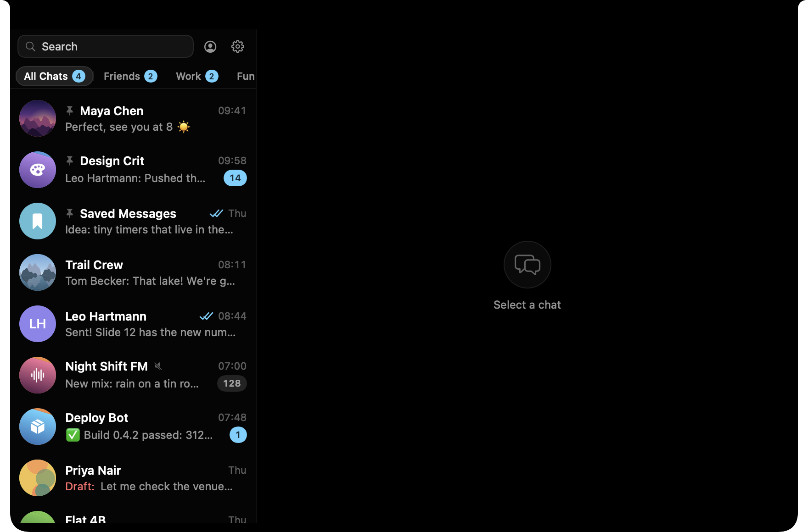
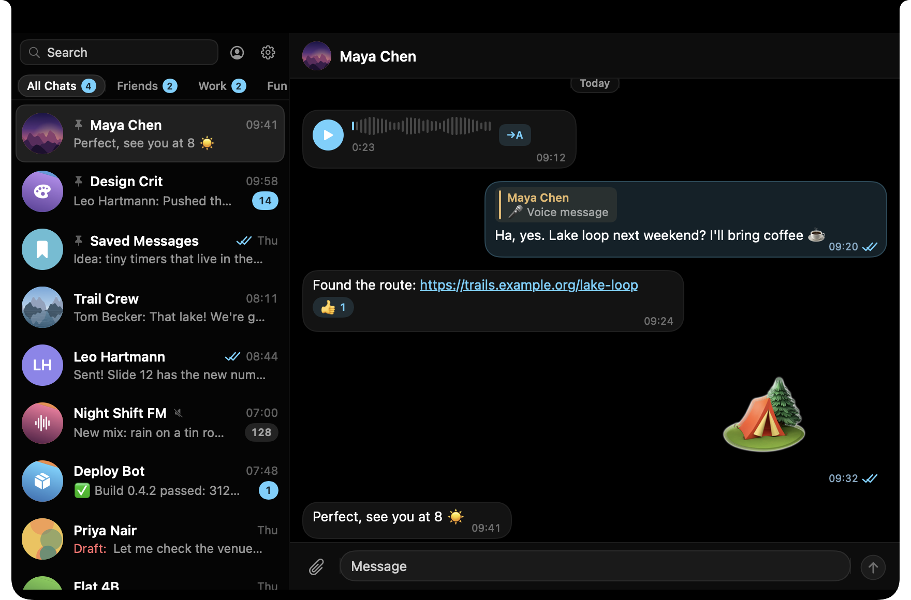
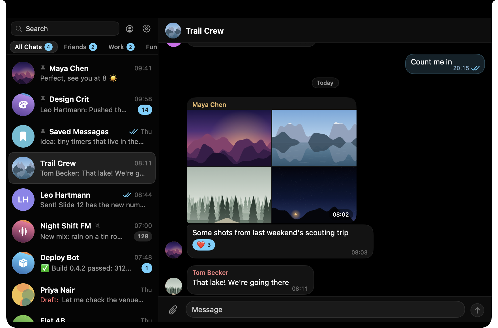
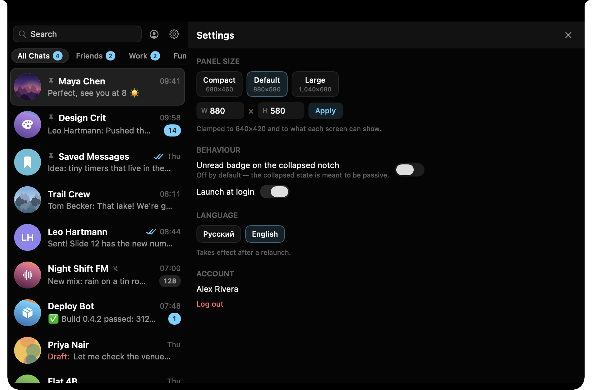

<p align="center">
  
</p>

<h1 align="center">NotchGram</h1>

<p align="center">
  A Telegram client that lives in your MacBook's notch.<br>
  Hover the notch, and a full chat panel unfolds. Move away, and it folds back.
</p>

<p align="center">
  
</p>

> **NotchGram is an unofficial Telegram client. It uses the Telegram API and is
> not affiliated with or endorsed by Telegram.**

NotchGram is a native macOS app (Swift 6, AppKit and SwiftUI) built on
[TDLib](https://github.com/tdlib/td), Telegram's official library for
third-party clients. It does not depend on the official Telegram app: it is
its own client, with its own login, that connects straight to Telegram's
servers.

## Features

**The notch panel**

- Hover the notch and the panel unfolds; move the pointer away and it folds.
  NotchGram never becomes the active app, so the app you were using stays
  in front.
- Displays without a notch (external monitors, older MacBooks) get a drawn
  tab half the width of a real notch, in the same place. Every display has
  its own panel, and only one is open at a time.
- The panel can be summoned over full-screen apps.
- Esc steps back one level (text field, then settings, then the open chat). A
  two-finger horizontal swipe closes the open chat.
- Panel size: presets or a custom size in Settings, kept within each screen.

**Chats**

- Sign in with phone number, code and two-step verification password.
- Chat list with pinned chats, folders as tabs with unread badges, unread
  counters and mute state, covering private chats, groups, channels and bots.
- A chat opens where Telegram would open it: at the first unread message
  (with an "unread messages" divider), at the bottom, or where you left off.
- Text messages with delivery and read ticks, typing indicators, date
  separators and reactions (shown, not yet sent). Channel footer with
  mute/unmute, and the composer is hidden where you can't post.
- Replies show the quoted message above the bubble, and links in messages
  are clickable.
- Search covers your chats, public chats by username, and messages across
  all chats.
- Notifications for new messages in unmuted chats.

**Media**

- Inline photos, GIFs, videos, static stickers, documents and voice messages.
  Animated (TGS) and video stickers show their static thumbnail.
- Round video messages play inline, with sound.
- Albums render as one mosaic post with a single caption.
- An in-panel viewer for photos and videos, with next/previous across the
  chat.
- Speech-to-text for voice and video messages through Telegram's own
  transcription, which needs Telegram Premium (Telegram offers a limited free
  trial).
- Send photos and files with the attach button, by pasting, or by dragging
  them onto the open panel.

**Other**

- English and Russian interface, switchable in Settings.
- Launch at login, and an optional unread badge on the folded notch.

**Not there yet:** replying, editing, deleting and forwarding messages;
sending reactions; recording voice messages; multiple accounts (planned, see
the [roadmap](docs/ROADMAP.md)).

## Screenshots

| Chat list | Conversation |
| --- | --- |
|  |  |
| **Media** | **Settings** |
|  |  |

All screenshots show demo data, not a real account.

## Install

Requires a Mac with Apple silicon and macOS 26 or later.

- **Download:** get `NotchGram-<version>.dmg` from the
  [latest release](https://github.com/f1lcry/notchgram/releases/latest) and drag
  NotchGram to Applications. Releases are signed with a Developer ID and
  notarized by Apple.
- **Homebrew:**

  ```sh
  brew install --cask f1lcry/tap/notchgram
  ```

NotchGram updates itself through [Sparkle](https://sparkle-project.org).

On first launch, hover the notch (or the drawn tab on a display without one)
and sign in with your Telegram account.

## Privacy

- **No server in between.** TDLib talks MTProto directly to Telegram's servers.
  There is no NotchGram backend, and your messages never pass through anyone
  else's infrastructure.
- **No analytics, no telemetry, no crash reporting.** The app makes no network
  requests of its own apart from Sparkle's update check, which downloads the
  release feed.
- **Local data** is TDLib's database (chats, messages, media cache) under
  `~/Library/Application Support/NotchGram/`. It is encrypted with a random
  256-bit key, one per account, stored in your login Keychain. The media cache
  is trimmed automatically (8 GB / 30 days).
- Settings such as panel size and language are stored in standard macOS
  preferences.
- Like every Telegram client, the app contains its own Telegram `api_id` and
  `api_hash`. They identify the app to Telegram, not you.

## Build from source

You need:

- macOS 26 or later on Apple Silicon, with Xcode 26 or later
- [XcodeGen](https://github.com/yonaskolb/XcodeGen) (`brew install xcodegen`),
  and `jq` for the automation scripts (`brew install jq`)
- your **own** Telegram API credentials: register an app at
  [my.telegram.org](https://my.telegram.org) → *API development tools*

```sh
git clone https://github.com/f1lcry/notchgram.git
cd notchgram
cp .env.example .env        # fill in TELEGRAM_API_ID and TELEGRAM_API_HASH
echo 'DEVELOPMENT_TEAM =' > Config/Local.xcconfig   # sign locally (see notes)
make deps                   # resolves TDLibKit (one ~343 MB download, cached)
make build                  # Debug build
make run                    # launches it
make test                   # unit tests
```

Notes:

- `project.yml` is the source of truth. The Xcode project is generated from it
  and is not committed, so always build through `make`.
- Signing: the tracked `Config/Signing.xcconfig` names the author's Apple
  team, so without an override `make build` fails with "No signing certificate
  … matching team ID". `Config/Local.xcconfig` (untracked) overrides it: an
  empty `DEVELOPMENT_TEAM`, as above, signs locally (ad-hoc), which is enough
  to build, run and test; set it to your own team ID to sign with your Apple
  developer account. Don't edit `project.yml` for this.
- `.env` is gitignored. The credentials reach the app only through
  `scripts/gen-secrets.sh` at build time, and are never logged.
- `scripts/preflight.sh` checks the full automation setup (Developer ID
  identity, notarization profile, Screen Recording and Accessibility grants for
  the screenshot harness). It is expected to report failures on a plain
  contributor machine; you don't need it to build or test.

See [CONTRIBUTING.md](CONTRIBUTING.md) for the rest of the workflow.

## Architecture

```
App (background app with no Dock icon; lifecycle, login item)
├── NotchShell     one borderless panel per display; polled hover; pure,
│                  unit-tested notch geometry
├── Features       SwiftUI: auth, chat list, conversation, media, search,
│                  settings, profile
├── TelegramCore   TDLib via TDLibKit: one client actor per account, auth
│                  state machine, chat and message stores fed by the
│                  ordered update stream
└── DebugBridge    local control socket (Debug builds only, off by default)
                   so every UI state can be driven and verified without a
                   mouse; compiled out of Release
```

[docs/ARCHITECTURE.md](docs/ARCHITECTURE.md) has the module map, the threading
model and more than 40 numbered decisions, each with the evidence behind it.
Examples: why hover is polled rather than tracked, why every TDLib request has
a deadline, and why SwiftUI's `VideoPlayer` is banned on macOS 26.

## How it was built

NotchGram was developed by its author directing autonomous AI coding-agent
sessions (Claude Code). The process was deliberate and it is all in the
repository:

- **A brief per session** acts as its contract. Planned sessions started
  from a written brief that sets the scope tiers, milestone order,
  verification gates, the exact points where a human is needed, and the
  definition of done. Fix sessions started from the author's spoken feedback,
  which the agent wrote down as that session's brief.
- **Four verification layers**: unit tests; a headless integration harness
  against Telegram's test data centre; UI smoke tests that drive the real app
  through the DebugBridge and check screenshots; and a real-account probe.
- **A report at the end of each session** records what shipped, what was
  verified and how, where the brief turned out wrong, and the debt left
  behind. Architecture decisions are amended in place, with the reason.

[docs/sessions/](docs/sessions/) is that record, from the founding
[concept](docs/CONCEPT.md) to the latest report. The author's feedback in it is
translated from Russian.

## Roadmap

[docs/ROADMAP.md](docs/ROADMAP.md) has the current status. Next up is
multi-account support with fast switching.

## License

NotchGram is free software: you can redistribute it and/or modify it under the
terms of the GNU General Public License as published by the Free Software
Foundation, either version 3 of the License, or (at your option) any later
version. See [LICENSE](LICENSE).

The third-party components it links, and their licenses, are listed in
[THIRD_PARTY_NOTICES.md](THIRD_PARTY_NOTICES.md).

## Acknowledgements

- [TDLib](https://github.com/tdlib/td): the Telegram Database Library
- [TDLibKit](https://github.com/Swiftgram/TDLibKit) and
  [TDLibFramework](https://github.com/Swiftgram/TDLibFramework) by Swiftgram:
  Swift bindings and prebuilt TDLib binaries
- [Sparkle](https://sparkle-project.org): software updates for macOS
- The notch-overlay apps that showed the interaction works, such as
  [boring.notch](https://github.com/TheBoredTeam/boring.notch) and NotchNook
